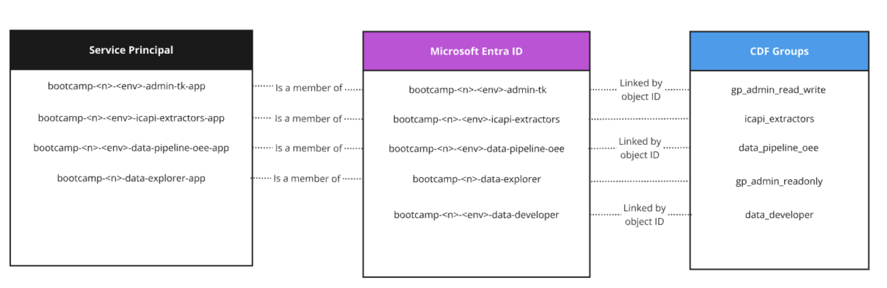
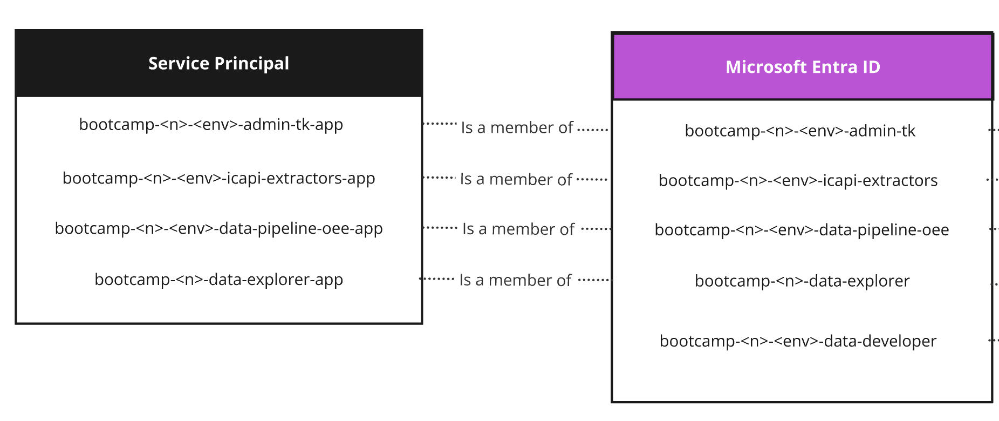

In order for the `Cognite Toolkit` to connect to CDF, we need to create a
[Service Principal](https://docs.microsoft.com/en-us/azure/active-directory/develop/howto-create-service-principal-portal "Learn more about Service Principals"){target=_blank}.
A **Service Principal** is a Microsoft Entra mechanism for access control of systems and services as opposed to persons.
It can be thought of as an actor that can be differentiated from an actual human that needs
credentials to be able to "login". A Microsoft Entra ID Service Principal always has an `Application (client) ID` (username), `Display name`, and `Client credentials`.
The access rights for the Service Principal is controlled through the Microsoft Entra ID Groups in the same manner as access for actual human users.
Every Service Principal belongs to a Microsoft Entra ID Application for the purpose of enhanced object grouping.

 Microsoft Entra ID allows you to have multiple services (secrets) to be mapped to different actors while representing the same logical application.

This Bootcamp will be using 3 Service Principals for each environment (test and prod):

- **admin-tk-app**: Used for configuration tools (`cdf-tk`)
- **icapi-extractors-app**: Used for the ICAPI source data extractors
- **data-pipeline-oee-app**: Used in machine calculations (transformation, calculations and data workflows)

The exception is the app that handles the OAuth2.0 authentication for Grafana.

- **prod-data-explorer-app**: Used for giving Grafana the ability to control access to its content explicitly and CDF data implicitly. Note this will be used only for our production environment, therefore there will be only one group and one service principal.

Here is the final mapping of all Service Principals to their Microsoft Entra ID and CDF groups:

   

### Create Microsoft Entra application registration

In this section, you will learn how to create an application registration and a secret for it. Follow these steps:

1. Open [Microsoft Entra ID](https://entra.microsoft.com){target=_blank}
2. In the upper right corner, click on your email and then `Switch directory`.
3. Click on `Switch` next to `cognite enablement bootcamp` directory.
4. Expand the `Applications` section in the left-hand panel and select  `App registrations`
5. Click on `New registration`
6. Fill in the following:
      1. Name like `bootcamp-<n>-test-admin-tk-app`, where `<n>` is your assigned bootcamp number
      2. Select the default supported account type (Account in this organization directory only)
7. Click `Register`
8. Note down the **Application (client) ID** for later use
9. Under `Client credentials` click on `Add a certificate or secret`
10. Click `New client secret`
11. Fill in the description (e.g. `bootcamp-<n>-test-admin-tk-app-secret`) and keep the default `Expiration`, then click `Add` at the bottom.
12. Note down the secret's **Value** for later use. This will _not_ be possible to recover later.

!!! warning
      You need to copy the **Value**, not the **Secret ID**.

### Create remaining Service Principals
Repeat the [Create Microsoft Entra application registration](#create-microsoft-entra-application-registration) step for the rest of the Service Principals. When you are finished you should have a total of 7 service principals.:

```
bootcamp-<n>-test-admin-tk-app
bootcamp-<n>-prod-admin-tk-app
bootcamp-<n>-test-icapi-extractors-app
bootcamp-<n>-prod-icapi-extractors-app
bootcamp-<n>-test-data-pipeline-oee-app
bootcamp-<n>-prod-data-pipeline-oee-app
bootcamp-<n>-prod-data-explorer-app
```

At the end, you should have a total of 7 service principals and secrets.

### Assign application to Microsoft Entra ID group
For the service principal to have correct permissions, it must be added as **member** of the corresponding group. As an example, we will follow the steps of adding `bootcamp-<n>-test-admin-tk-app` as a member of `bootcamp-<n>-test-admin-tk` Microsoft Entra ID group. Note: `<n>` is your assigned bootcamp instance number.

Assign application to its group:

1. From the [Microsoft Entra ID](https://entra.microsoft.com){target=_blank} overview.
2. Expand `Identity`.
2. Expand the `Groups` section and select `All groups`.
3. Search for `bootcamp-<n>-test-admin-tk`, where `<n>` is your assigned bootcamp number and select the group.
4. Select `Members`
5. Click `Add members`

    !!! info inline end "Can't Find it?"
        Try entering the full `Display name` of the Application including the suffix

6. Search for the application name from the section above (e.g. `bootcamp-01-test-admin-tk-app`) and click on the checkbox to select it
7. Click `Select` at the bottom

Repeat the steps in the [Assign the application to the Microsoft Entra ID group](#assign-application-to-microsoft-entra-id-group) section to add the remaining service Principals to their corresponding groups:

| Application name                          | Group membership                      |
| :---------------------------------------: | :-----------------------------------: |
| `bootcamp-<n>-test-admin-tk-app`          | `bootcamp-<n>-test-admin-tk`          |
| `bootcamp-<n>-prod-admin-tk-app`          | `bootcamp-<n>-prod-admin-tk`          |
| `bootcamp-<n>-test-icapi-extractors-app`  | `bootcamp-<n>-test-icapi-extractors`  |
| `bootcamp-<n>-prod-icapi-extractors-app`  | `bootcamp-<n>-prod-icapi-extractors`  |
| `bootcamp-<n>-test-data-pipeline-oee-app` | `bootcamp-<n>-test-data-pipeline-oee` |
| `bootcamp-<n>-prod-data-pipeline-oee-app` | `bootcamp-<n>-prod-data-pipeline-oee` |
| `bootcamp-<n>-prod-data-explorer-app`     | `bootcamp-<n>-prod-data-explorer`     |

!!! note
      Ask your instructor to add your `test-admin-tk-app` and `prod-admin-tk-app` to your `participant` group.

At the end, it should look like this:

   
