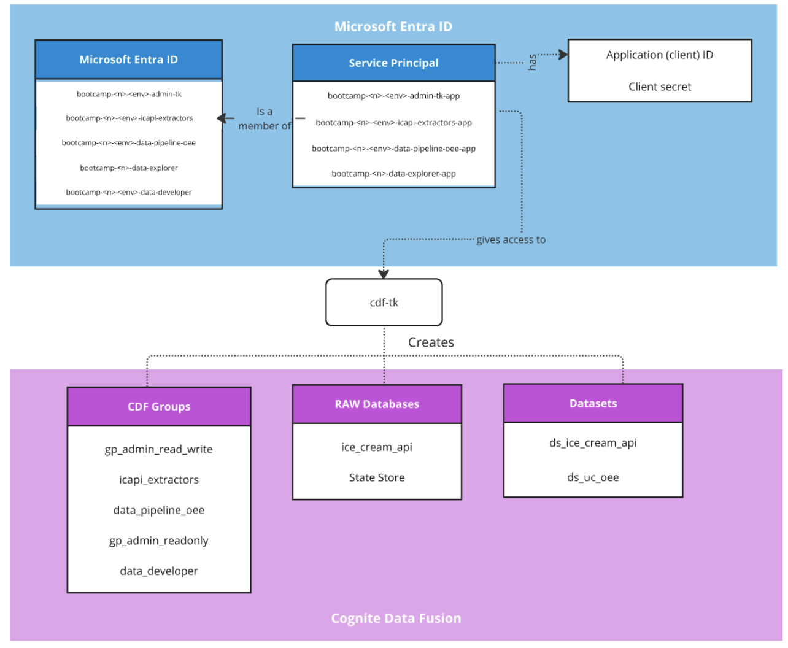

## Overview
Expected time: 6 hours

???+ success "Prerequisites"
    - Complete [Prerequisite steps](https://learn.cognite.com/page/bootcamp-catalog)

???+ abstract "Learning Objectives"
    - [x] Explain the objective of the Cognite Data Fusion (CDF) Toolkit, `cdf-tk`, in configuring CDF
    - [x] Complete the initial setup of CDF: creating groups, datasets and RAW databases
    - [X] Showcase best practices when configuring access control
    - [x] Showcase best practices when configuring CDF access control

In this chapter, you will configure the Microsoft Entra ID groups used for access control and
use the Cognite Data Fusion Toolkit to programmatically create
[Groups](https://docs.cognite.com/dev/guides/iam/#groups){target=_blank},
[Datasets](https://docs.cognite.com/cdf/learn/cdf_basics/cdf_basics_governance/#data-sets){target=_blank}, and
[RAW databases](https://docs.cognite.com/cdf/integration/guides/extraction/raw_explorer/){target=_blank} in CDF
and map the Microsoft Entra ID groups to the newly created CDF Groups. This mapping allows you to control access to the data in CDF using Microsoft Entra ID.

The Cognite Data Fusion Toolkit (**CDF Toolkit**) gives us a quick and flexible method for setting up CDF on Day 1 of a project. Having a flexible method for setting up a CDF project makes it easier to extend (scale) the project. For example, adding additional Ice Cream Factory locations, more granular access control, or building a new use case.

You will work in Microsoft Entra ID, creating Service Principals (App Registration and Client Credentials) and their corresponding secrets, then assigning those Service Principals to their appropriate Microsoft Entra ID group. You will then initialize your own CDF Toolkit repository and configure it to deploy the initial groups the CDF Toolkit requires.

The overall architecture of the Data foundation:
 

The following Microsoft Entra ID groups have already been created for your project:

- **admin-tk**: This group is scoped to the capabilities the CDF Toolkit requires to deploy all configurations to the CDF project. The only member will be the service principal for the CDF Toolkit.
- **icapi-extractors**: This group's members will be the service principals used to configure Extractors, Extraction Pipelines, and the Staging (**RAW**) databases/tables required by them.
- **prod-data-explorer**: This group is used for read access to all data sets in CDF. It will provide access to the Industrial tools, which are usually used by data consumers or domain experts. There will be only one group for data-explorer, for the **prod** environment.
- **data-developer**: This group is used for read **and** write access to all data sets in CDF; members are typically data owners and developers
- **data-pipeline-oee**: This group is used by the service principals that configure transformations, functions and data workflows for the oee use case. Scoping a single group per use case is the recommended way to organize them for extension/deprecation.

Each Microsoft Entra ID group's name is prefixed with the name of your CDF project, followed by the name of the
environment (i.e., `test` or `prod`) and postfixed by the role. For example, for the CDF project `cdf-bootcamp-01` for `test`, the toolkit's admin group is named
`bootcamp-01-test-admin-tk`.

!!! note "Naming Conventions"
    During the Bootcamp, you will make many naming decisions. In order to have structured naming, here is an overview of recommended naming conventions

     **Microsoft Entra ID Groups**

     `bootcamp-<n>-<env>-<cdf group postfix>`

     - Example: `bootcamp-14-prod-data-explorer`

     **Microsoft Entra ID Apps**

     `bootcamp-<n>-<env>-<cdf group postfix>-app`

     - Example: `bootcamp-14-prod-data-explorer-app`

 You will be asked for the Microsoft Entra ID Group's name and `Object ID` listed above throughout the bootcamp. Navigate to [Microsoft Entra ID](https://entra.microsoft.com){target=_blank}, switch to the `cognite enablement bootcamp` directory, and find your project's groups. You can filter your groups by entering `bootcamp-<n>-` at the top of the group list. Note down the Group name and Object ID of these groups. 
